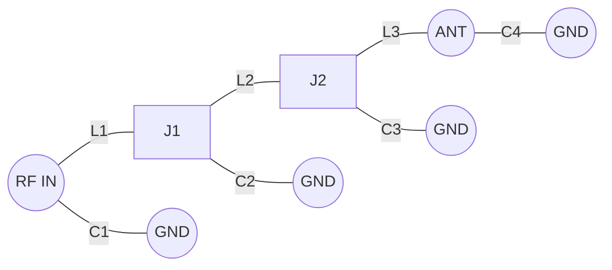

# ESP32 WSPR/CW Beacon

A standalone HF Beacon (WSPR & CW) running on an ESP32.
It uses the ESP32's internal APLL (Audio PLL) routed via I2S to generate a precise, low-jitter RF signal directly on a GPIO pin.

## Features
- **WSPR Beacon**: Transmits standard WSPR Type 1 messages on the 20m band (14.0956 MHz).
- **CW Identification**: Transmits Morse code ID (Callsign + Grid) every 10 minutes.
- **Precision Timing**: Syncs via NTP over WiFi to ensure perfect WSPR timing.
- **OLED Display**: Shows current status, time, IP address, and transmission progress.
- **Direct RF Output**: Generates RF directly from a GPIO pin (default GPIO 27).
- **Power Output**: Approx. **10-15 mW (10-12 dBm)** direct drive.

## Hardware Required
1. **ESP32 Development Board** (ESP32-WROOM-32 or similar)
2. **SSD1306 OLED Display** (I2C)
3. **Low Pass Filter (LPF)** for 20m Band (Critical for harmonic suppression)
4. **Antenna** (tuned for 14 MHz)

## Wiring

| ESP32 Pin | Component | Function |
|-----------|-----------|----------|
| **GPIO 27**| **RF Output** | Signal to LPF -> Antenna |
| GPIO 21   | OLED SDA  | I2C Data |
| GPIO 22   | OLED SCL  | I2C Clock|
| 5V / 3V3  | VCC       | Power |
| GND       | GND       | Ground |

**Note**: The RF Output pin can be changed in `src/Config.h`.

## Low Pass Filter (LPF)
The output is a square wave. You **MUST** use a Low Pass Filter before connecting an antenna to prevent interference on higher harmonics.

**Schematic (20m / 14MHz):**

- **L1, L3**: 12 turns (~0.6 uH) on T37-6
- **L2**: 14 turns (~0.7 uH) on T37-6
- **C1, C4**: 470 pF
- **C2, C3**: 1000 pF

## Configuration
Open `src/Config.h` and configure your station:
```cpp
#define WIFI_SSID "YOUR_SSID"
#define WIFI_PASS "YOUR_PASSWORD"
#define CALLSIGN "N0CALL"      // Your Callsign
#define GRID_LOCATOR "AA00aa"  // Your Grid Square
#define RF_PIN 27              // Output Pin
```

## Build & Upload
This project uses **PlatformIO**.

1. Clone the repository.
2. Open in VSCode with PlatformIO extension.
3. Edit `src/Config.h`.
4. Run **Upload**:
   ```bash
   pio run -t upload
   ```
5. Monitor output:
   ```bash
   pio device monitor
   ```

