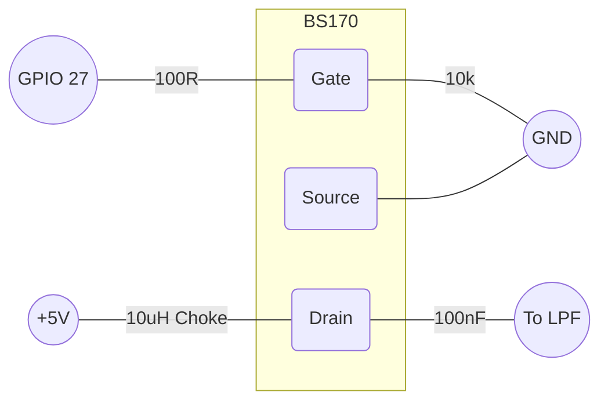
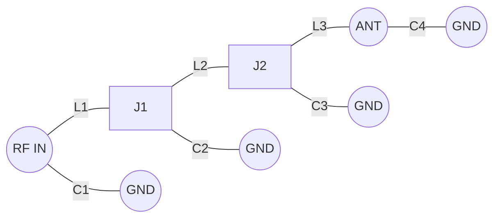

# ESP32 WSPR/FT8/CW Beacon

A standalone HF Beacon (WSPR, FT8 & CW) running on an ESP32.
It uses the ESP32's internal APLL (Audio PLL) clocking the I2S bit clock (BCK), routed through the GPIO matrix to generate RF directly on a GPIO pin. Because the APLL's native tuning step (~19 Hz at 14 MHz) is far coarser than the WSPR/FT8 tone spacing, a background task dithers the APLL fractional divider (software fractional-N synthesis) so the average frequency lands exactly on the requested tone.

## Features
- **WSPR Beacon**: Transmits standard WSPR Type 1 messages on the 20m band (14.0956 MHz).
- **FT8 Beacon**: Transmits `CQ CALL GRID` on 14.074 MHz in four consecutive 15 s slots.
- **CW Identification**: Transmits Morse code ID (Callsign + Grid) once per cycle.
- **Precision Timing**: Syncs via NTP over WiFi to ensure perfect WSPR/FT8 slot timing.
- **Frequency Calibration**: PPM correction constant to compensate crystal error.
- **OLED Display**: Shows current status, time, and transmission progress.
- **Direct RF Output**: Generates RF directly from a GPIO pin (default GPIO 27).
- **Power Output**: Approx. **10-15 mW (10-12 dBm)** direct drive.

## Transmission Schedule
The beacon runs a fixed 4-minute cycle, aligned to UTC:

| Minute (mod 4) | Mode | Start |
|----------------|------|-------|
| 0–1 | WSPR (110.6 s) | :01 |
| 2   | FT8 (4 slots)  | :01, :16, :31, :46 |
| 3   | CW ID          | :10 |

## Hardware Required
1. **ESP32 Development Board** (ESP32-WROOM-32 or similar)
2. **SSD1306 OLED Display** (I2C)
3. **Low Pass Filter (LPF)** for 20m Band (Critical for harmonic suppression)
4. **Antenna** (tuned for 14 MHz)

## Wiring

| ESP32 Pin | Component | Function |
|-----------|-----------|----------|
| **GPIO 27**| **RF Output** | Signal to LPF -> Antenna |
| GPIO 21   | OLED SDA  | I2C Data |
| GPIO 22   | OLED SCL  | I2C Clock|
| 5V / 3V3  | VCC       | Power |
| GND       | GND       | Ground |

**Note**: The RF Output pin can be changed in `src/Config.h`.

## Optional Power Amplifier (Boost to ~250mW)
To increase power from ~10mW to ~250mW (24dBm), use a simple BS170 MOSFET amplifier.

**Schematic:**

```mermaid
graph LR
    GPIO((GPIO 27)) -- 100R --- G
    G -- 10k --- GND
    
    subgraph BS170
    G(Gate)
    D(Drain)
    S(Source)
    end
    
    S --- GND((GND))
    VCC((+5V)) -- 10uH Choke --- D
    D -- 100nF --- LPF((To LPF))
```
- **Q1**: BS170 or 2N7000 MOSFET
- **Choke**: 10uH RF Choke (RFC)
- **C_Block**: 100nF Ceramic
- **R_Gate**: 100 ohm (Series), 10k (Pulldown)

## Low Pass Filter (LPF)
The output is a square wave. You **MUST** use a Low Pass Filter before connecting an antenna to prevent interference on higher harmonics.

**Schematic (20m / 14MHz):**

```mermaid
graph LR
    IN((RF IN)) -- L1 --- J1
    J1 -- L2 --- J2
    J2 -- L3 --- ANT((ANT))
    
    IN -- C1 --- G1((GND))
    J1 -- C2 --- G2((GND))
    J2 -- C3 --- G3((GND))
    ANT -- C4 --- G4((GND))
```
- **L1, L3**: 12 turns (~0.6 uH) on T37-6
- **L2**: 14 turns (~0.7 uH) on T37-6
- **C1, C4**: 470 pF
- **C2, C3**: 1000 pF

## Configuration
`src/Config.h` is gitignored (it contains your WiFi credentials). Create it from the template and configure your station:
```bash
cp src/Config.h.example src/Config.h
```
```cpp
#define WIFI_SSID "YOUR_SSID"
#define WIFI_PASS "YOUR_PASSWORD"
#define CALLSIGN "N0CALL"          // Your Callsign
#define GRID_LOCATOR "AA00aa"      // Your Grid Square
#define FREQ_CORRECTION_PPM 0.0    // Crystal error correction (see below)
#define RF_PIN 27                  // Output Pin
```

### Frequency Calibration
Devboard crystals are typically off by 10–20 ppm, which is 150–300 Hz at 14 MHz — enough to land outside the 200 Hz WSPR window. Measure the actual carrier with an SDR during a transmission and set the correction:

```
measured 14095750 Hz vs requested 14095600 Hz -> +150 Hz error
FREQ_CORRECTION_PPM = -offset_hz / freq_mhz = -150.0 / 14.0956 = -10.6
```

## Build & Upload
This project uses **PlatformIO**.

1. Clone the repository.
2. Open in VSCode with PlatformIO extension.
3. Create and edit `src/Config.h` (see Configuration).
4. Run **Upload**:
   ```bash
   pio run -t upload
   ```
5. Monitor output:
   ```bash
   pio device monitor
   ```

## Verifying with an SDR
- Tune an SDR (e.g. HackRF with gqrx/SDR++) to 14.0956 MHz in USB/CW mode and watch the waterfall during minutes 0–1 of the cycle. Expect the carrier within a few hundred Hz of nominal until you calibrate `FREQ_CORRECTION_PPM`.
- To verify decodes, feed the SDR audio into WSJT-X (WSPR mode on 20m, or FT8 during minute 2).
- **Never connect the beacon output to the SDR input with a cable directly**: +10 dBm is at the absolute maximum input rating of a HackRF. Receive over the air, or use at least 30 dB of attenuation.
- Note: VHF/UHF FM handhelds (e.g. AnyTone AT-D878UV) cannot receive this beacon — 14 MHz is outside their frequency range, and an FM receiver cannot demodulate a CW carrier anyway.

